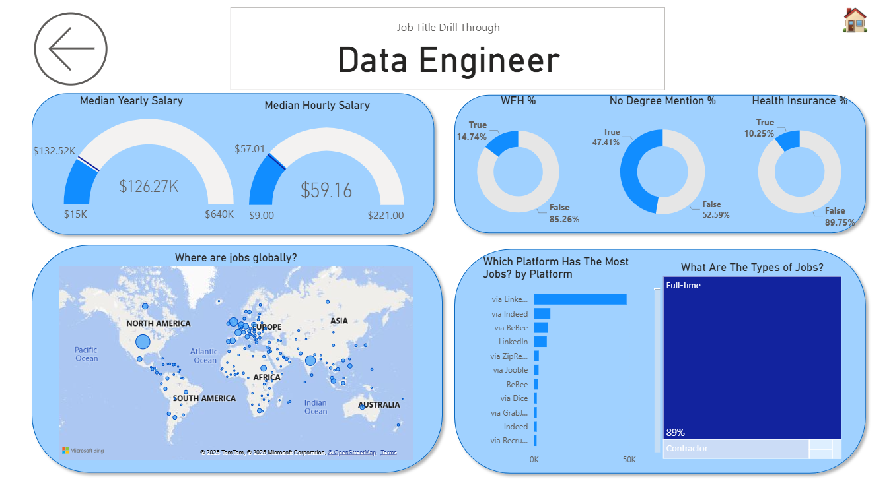

# My Power BI Dashboard Portfolio 📊

Welcome to my Power BI dashboards collection. This repository showcases my learning journey from foundational data reports to advanced interactive dashboards, turning raw data into actionable business insights.

## Featured Dashboards

### Data Jobs Dashboard (V1 - Comprehensive Exploration)
- Focus on ETL, basic data modeling, and core visualizations.
- Skills: Power Query transformations, implicit measures, KPI cards, interactive slicers.
-   
- 

### Data Jobs Dashboard 2.0 (V2 - Single-Page UX & Optimization)
- Advanced dashboard design emphasizing user experience and report performance.
- Skills: Explicit DAX, star schema modeling, dynamic visuals, parameter-driven what-if analysis.
- 

## About This Portfolio

Due to corporate restrictions, live Power BI reports cannot be shared publicly. Instead, this repository includes screenshots and detailed READMEs for each dashboard. For inquiries or private demonstrations, feel free to contact me.

Thanks to Barousse for the excellent course that inspired these projects.

---

